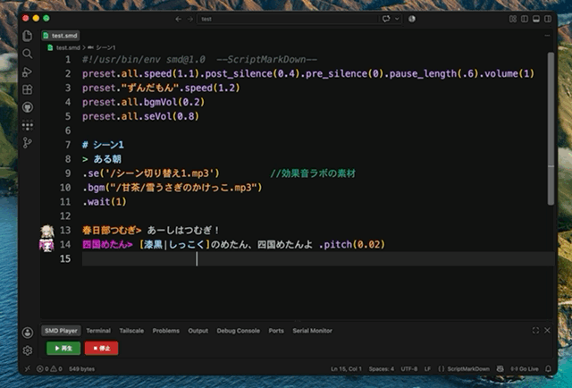

# ScriptMarkDown

VOICEVOX Engine と連携してリアルタイムに読み上げながら、台本・シナリオ・脚本を書けるVS Code拡張機能です。

<!-- TODO: 公開前にデモGIF/スクリーンショットを撮影してここに追加する -->
<!--  -->

## 概要

ScriptMarkDown（`.smd`）は、**「1台詞1行」** の原則に従い、上から下へ順番に評価・再生される台本用マークダウン拡張フォーマットです。

```smd
ずんだもん> こんにちはなのだ！
四国めたん.ツンツン> ごきげんよう、勘違いしないでほしいですわ！.pitch(-0.02)
```

話速・音高・抑揚・音量などのパラメータをメソッドチェーンで宣言的に書け、エディタのインテリセンス補完を使いながら、VOICEVOX Engineでその場で試聴・通し再生しながら台本を書き進められます。

## 主な特徴

- **VOICEVOX Engine連携リアルタイム再生** — Shift+Enterでカーソル行を単発再生、上部の再生ボタンで現在行から最後まで連続再生
- **インテリセンス補完** — 話者名・スタイル名・SE/BGM/立ち絵ファイルパス・演出パラメータをサジェスト、↑/↓キーで試聴プレビューしながら選択可能
- **ホバー試聴プレビュー** — `.se()` / `.bgm()` 行にカーソルを合わせると、ファイルの存在確認・試聴・Finder表示ができる
- **メソッドチェーンによる宣言的パラメータ指定** — `.speed()` `.pitch()` `.intonation()` `.volume()` などをセリフ末尾に直付けして1行だけ上書き可能
- **話者アイコン付きガター装飾・行ハイライト** — 話者ごとの色分けや、再生中/合成中の行を視覚的にハイライト
- **リンク切れ検出（Diagnostics）** — 存在しないSE/BGM/立ち絵ファイルを警告表示
- **`available_param.yaml` エクスポート** — 使用可能な書式・話者・SE/BGM素材の一覧をYAMLで出力
- **VS Code Language Model Tool連携** — GitHub Copilot等のAIエージェントから話者一覧取得・台本バリデーションを呼び出し可能

## 必要要件

- [VOICEVOX](https://voicevox.hiroshiba.jp/) をインストールし、**VOICEVOX Engineを起動しておく**必要があります（アプリ本体を起動していればEngineも一緒に立ち上がります）
- デフォルトの接続先は `http://localhost:50021` です。別ホスト・別ポートで起動している場合は設定 `smd.engineUrl` を変更してください
- Engineが起動していない状態で再生を行うと、接続先URLを含むエラー通知が表示されます

## インストール

VS Code Marketplaceで「ScriptMarkDown」を検索してインストールするか、`.vsix` ファイルから手動インストールしてください。

```bash
code --install-extension script-markdown-0.1.0.vsix
```

## クイックスタート

1. 拡張子 `.smd` のファイルを新規作成
2. VOICEVOX Engineを起動
3. 以下のように話者名とセリフを書く

```smd
ずんだもん> こんにちはなのだ！
四国めたん> ごきげんよう。
```

4. カーソルをセリフ行に置いて `Shift+Enter` で単発試聴、またはエディタ右上の再生ボタンで現在行から最後まで連続再生

パラメータの完全な一覧・優先順位ルール・全構文サンプルは [DOCUMENTATION.md](DOCUMENTATION.md) を参照してください。

## コマンド一覧

| コマンド | 説明 |
| :--- | :--- |
| `ScriptMarkDown: Open Audio Engine Player Tab` | 音声再生用パネルを開く |
| 再生 (Shift+Enter) | カーソル行のセリフを単発再生 |
| 停止 | 再生中の音声・BGMを停止 |
| `ScriptMarkDown: Play VOICEVOX Engine Voice (Current Line)` | カーソル行のセリフをVOICEVOX Engineで再生 |
| `ScriptMarkDown: Insert Speaker 1〜9` | 登録済み話者名をショートカットで挿入 |
| `ScriptMarkDown: Toggle Speaker Icons` | エディタ行頭ガターの話者アイコン表示切替 |
| `ScriptMarkDown: ベイクしてコピー` | ルビ処理・パラメータを整形したテキストをクリップボードへコピー |
| `ScriptMarkDown: VOICEVOX用テキスト (.txt) へエクスポート` | VOICEVOXのテキストファイル読み込み形式へエクスポート |
| `ScriptMarkDown: 使用可能な書式・話者・SE/BGM一覧を出力 (available_param.yaml)` | 使用可能なパラメータ・話者・素材一覧をYAML出力 |
| `ScriptMarkDown: ワークスペース設定 (.vscode/settings.json) を作成・初期化` | プロジェクト用設定ファイルを初期化 |

## キーボードショートカット

| キー | 動作 |
| :--- | :--- |
| `Cmd/Ctrl + 1`〜`9` | 話者1〜9のショートカット挿入（`.smd`ファイル編集中のみ） |
| `Shift + Enter` | カーソル行の1台詞を単行再生 |
| `↑` / `↓`（サジェスト表示中） | 補完候補の選択＆試聴音声の反復再生 |

話者ショートカットの初期割り当ては [presets.json](presets.json) を参照してください。`smd.shortcuts` 設定で自由に上書きできます。

## 設定項目

| 設定キー | 説明 | デフォルト値 |
| :--- | :--- | :--- |
| `smd.engineUrl` | VOICEVOX Engine の REST API サーバーURL | `http://localhost:50021` |
| `smd.seDir` | 外部SE素材フォルダーの絶対パス | `""` |
| `smd.bgmDir` | 外部BGM素材フォルダーの絶対パス | `""` |
| `smd.tatieDir` | 外部立ち絵素材フォルダーの絶対パス | `""` |
| `smd.showSpeakerIcons` | エディター行頭ガター部に話者アイコンを表示するか | `true` |
| `smd.shortcuts` | `Cmd/Ctrl+数字` で挿入される話者名の上書き | `{}` |
| `smd.speakers` | 話者定義（スタイル名・styleId・カラー等）の上書き・追加 | `[]` |
| `smd.playingHighlightColor` | 再生中の行のハイライトカラー | `rgba(46, 204, 113, 0.45)` |
| `smd.synthesizingHighlightColor` | 音声合成中の行のハイライトカラー | `rgba(150, 150, 150, 0.12)` |

## カスタマイズ

ユーザー設定（グローバル）、またはプロジェクトの `.vscode/settings.json` で、ショートカットキーやキャラクター定義を自由に上書きできます。

```json
{
  "smd.shortcuts": {
    "1": "ずんだもん> ",
    "2": "四国めたん> ",
    "3": "オリジナルキャラ> "
  },
  "smd.speakers": [
    {
      "id": "my_custom_speaker",
      "name": "オリジナルキャラ",
      "aliases": ["オリジナルキャラ", "オリキャラ"],
      "styles": ["ノーマル"],
      "styleIds": [0],
      "defaultStyle": "ノーマル",
      "color": "#ff007f"
    }
  ]
}
```

設定の優先順位や詳細な記法は [DOCUMENTATION.md](DOCUMENTATION.md) を参照してください。

## トラブルシューティング

- **再生してもエラーが出る / 何も再生されない** — VOICEVOX Engineが起動しているか確認してください。`smd.engineUrl` が実際のEngineの待受アドレスと一致しているかも確認してください。接続に失敗した場合は接続先URLを含むエラー通知が表示されます
- **SE/BGM/立ち絵ファイルが見つからないと警告される** — `smd.seDir` / `smd.bgmDir` / `smd.tatieDir` の設定、またはファイルパスの指定を見直してください
- **話者名やスタイル名が補完に出てこない** — `smd.speakers` の設定内容、またはVOICEVOX側にそのスタイルが存在するかを確認してください

## ライセンス

[MIT License](LICENSE)

## リンク

- [DOCUMENTATION.md](DOCUMENTATION.md) — 記法・動作仕様の完全ガイド
- [CHANGELOG.md](CHANGELOG.md) — 更新履歴
- [VOICEVOX](https://voicevox.hiroshiba.jp/) — 本拡張機能が連携する音声合成エンジン
